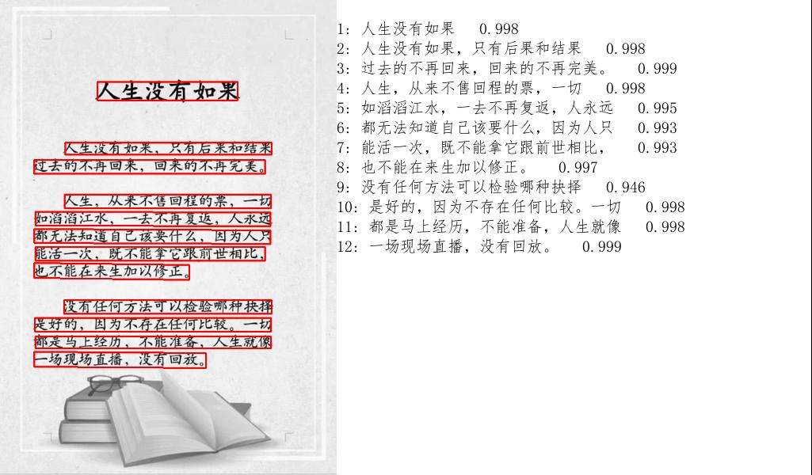

# OCR Assignment 1 (Based on PaddleOCR)
## 1. Introductions
### 1.1 Introduction to OCR
OCR, or Optical Character Recognition, is a technology capable of converting textual information in image files into electronic text. The basic principle involves scanning printed characters on paper using electronic devices such as scanners or digital cameras, capturing images of the characters through optical technology, and converting these images into computer-readable text information through a series of complex algorithms. This process typically includes steps such as image preprocessing, text detection, feature extraction, text recognition, and post-processing.

### 1.2 Introduction to PaddleOCR
For this assignment, I chose PaddleOCR, developed by Baidu, which performs exceptionally well. PaddleOCR is a powerful and open-source OCR (Optical Character Recognition) tool based on Baidu's PaddlePaddle deep learning framework.

PP-OCR, a practical and ultra-lightweight OCR system developed by PaddleOCR, balances accuracy and speed through advanced algorithms, model thinning, and deep optimization to meet industrial needs. The system consists of text detection and text recognition stages, using the DB algorithm for text detection and CRNN for text recognition. A text direction classifier is added between detection and recognition modules to handle text in different directions. In this program, I used the PP-OCRv3 module, which has seen upgrades in 9 aspects compared to PP-OCRv2, further enhancing model performance:

#### Chinese Scenes: Improved by over 5% compared to PP-OCRv2.
#### English & Digital Scenes: Improved by 11% compared to PP-OCRv2.
#### Multi-language Scenarios: Optimized recognition effect for 80+ languages, improving average accuracy by over 5%.
### 1.3 Introduction to This Assignment
The program developed in this assignment is based on PaddleOCR. It automatically preprocesses input images, extracts text from the preprocessed images, and stores the text content in a local txt file. The program also includes visualization functionalities to display the detection process.

ocr.py: Contains functionalities for preprocessing images, extracting text from a single image, and storing the extracted text in a local txt file.
pdf_OCR.py: Allows users to extract text from PDF files.

## Text Recognition Result of a Single Image

## Text Recognition Result of a PDF File

Both scripts perform exceptionally well.
